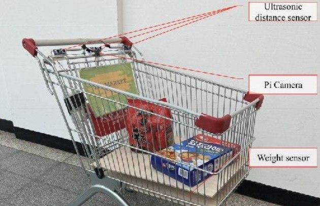
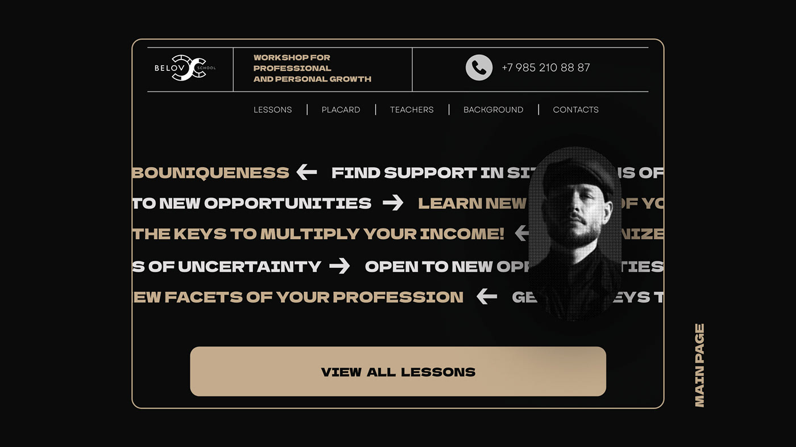
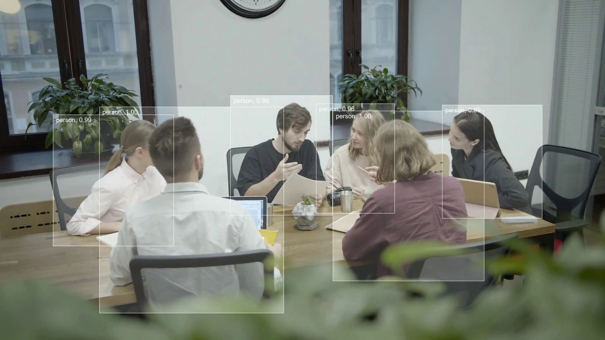

    

        

            

                

                

                

            

            

                
humblee-ai.com

            

        

        

            
        

    

    

        

            

                

                

                

            

            

                
humblee-ai.com

            

        

        

            
        

    

    

        

            

                

                

                

            

            

                
humblee-ai.com

            

        

        

            
        

    

    

        

            

                

                

                

            

            

                
humblee-ai.com

            

        

        

            
        

    

gsap.set('.project-item', { position: 'absolute' })
gsap.to('.project-item', {
yPercent: -100,
stagger: 0.5,
scrollTrigger: {
trigger: '.projects-wrapper',
markers: true,
scrub: true,
pin: true,
start: 'top top',
end: '+=3000px'
}
})

